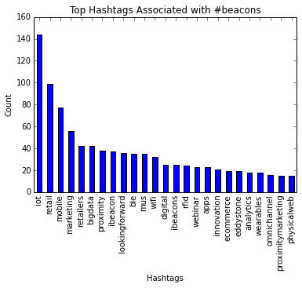
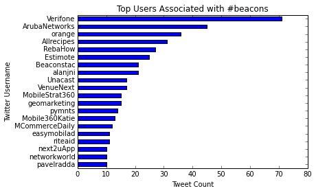

# Sentiment and Tweet Analysis

I wanted to get a better understanding of beacon technology as well as the beacon industry. Beacons enable your phone or tablet to receive signals from the physical world (e.g., as you walk by a vending machine, a beacon on the machine could send a signal to your phone that they it has your favorite chocolate bar). So I scraped tweets sent between Jan 23 and Jan 16, 2016 with the hashtag beacons. This resulted in 1,200 tweets. You can view the code for the analysis [here](https://github.com/skasim/twit_sentiment/blob/master/tweet_and_sentiment_analysis_beacons.ipynb).

### Sentiment Analysis
Subsequently, I conducted a sentiment analysis of the tweets and found that only ~15% of the tweets registered for sentiment. This is likely a result of tweets that are more informative and neutral in sentiment (e.g. of such a tweet, RT @Verifone: #NRF16 takeaway: enhancing the consumer experience w/ #beacons https://t.co/c68gM3IFon @Allrecipes @RebaHow https://t.co/nnub\xe4\xf3_). However, for the tweets that did have a sentiment, there were four times as many positives as negative tweets.

### Hashtags
I also wanted to see what other hashtags were associated with the beacons hashtags and found, not surprisingly, that IoT was the number one hashtag followed by retail. The retail sector is an early adopter and promoter of beacon technology. Hashtags for mobile, marketing, and retailers rounded out the top five hashtags and give a strong indication that the focus for beacon technology currently is on its applications in retail and marketing. See below for the top 25 hashtags.



### Usernames
Last, I wanted to know who the big players are in this field, so I wanted to get a sense of the top users associated with the beacons hashtag (see the graph below). Verifone, a company known for e-payment transactions and point-of-sale services, and ArubaNetworks, which sells selling enterprise wireless LAN equipment, were the top two tweeters. A username, I was surprised to see pop in the top five was AllRecipes, a digital foods brand. However, once I dug deeper, I found that AllRecipes will pilot Verifone's beacon system in grocery stores. Whether in grocery stores or at the point-of-sale, this is an exciting time for beacon technology.



# To Run

Run in Jupyter using the below:

```
import nltk
import csv
import numpy as np
import re
from collections import defaultdict
from operator import itemgetter
import matplotlib.pyplot as plt
%matplotlib inline
import pandas as pd
```